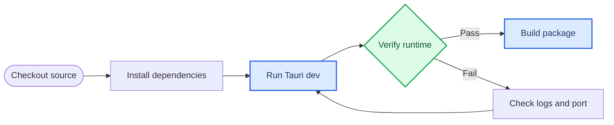

# SoftUI 部署运行与二次开发说明

_适用对象：SoftUI 上位机迁移项目维护者、二次开发者和测试人员。最后更新：2026-07-19。_

---

## 项目定位

SoftUI 是绳驱连续体机器人桌面上位机迁移项目。当前迁移目标以 Tauri 2、Rust、React 和 TypeScript 为主，旧 Python/PyQt 项目仅作为功能对照和协议迁移参考。

二次开发时必须保持边界清晰：Rust 负责串口、Legacy Protocol V1、设备运行时、安全控制、存储、日志和诊断；React 只负责界面呈现和用户交互。3D 展示模块当前暂缓，不作为近期开发和验收重点。

### 运行链路



---

## 环境要求

| 项目 | 建议版本 | 验证命令 | 用途 |
| --- | --- | --- | --- |
| Git | 2.x | `git --version` | 拉取和推送源码 |
| Node.js | 20 LTS 或更新 | `node --version` | 前端依赖和 Vite |
| npm | 随 Node 安装 | `npm --version` | 安装前端依赖 |
| Rust | stable | `rustc --version` | Tauri 后端编译 |
| Cargo | 随 Rust 安装 | `cargo --version` | Rust 依赖和测试 |
| WebView2 Runtime | Windows 已安装或系统提供 | Windows 应用运行验证 | Tauri 窗口运行 |
| Microsoft C++ Build Tools | 与 Rust MSVC 工具链匹配 | `rustup show` | Windows 原生编译 |

### 推荐检查

```powershell
git --version
node --version
npm --version
rustc --version
cargo --version
rustup show
```

所有命令都应正常输出版本信息。若 Rust 工具链缺失，先安装 stable MSVC 工具链，再执行后续步骤。

---

## 首次部署运行

### 克隆指定分支

```powershell
git clone -b ding https://github.com/Blinest/Control_Interface.git
cd Control_Interface
```

### 安装前端依赖

```powershell
cd softui-desktop
npm ci
```

预期结果是依赖安装完成，并生成可用的 `node_modules/`。该目录是本地生成物，不应提交。

### 启动开发版上位机

```powershell
npm run tauri dev
```

项目固定使用 Vite 端口 `1421`。如果该端口已被其他进程占用，`tauri dev` 会直接失败；先关闭占用端口的 SoftUI 开发进程，再重新启动。

### 验证运行状态

启动后应看到 SoftUI 桌面窗口。基础验证点如下：

| 验证点 | 期望结果 |
| --- | --- |
| 应用标题 | `SoftUI` |
| 主窗口尺寸 | 可在最小尺寸 `1280 x 800` 以上缩放 |
| 端口 | Vite 监听 `localhost:1421` |
| 默认设备 | 无真实串口时可使用模拟器状态 |
| 页面 | 总览、设备工作区、曲线分析、日志管理、设置可切换 |

---

## 常用开发命令

所有命令默认在 `softui-desktop/` 目录执行。

| 操作 | 命令 | 说明 |
| --- | --- | --- |
| 安装依赖 | `npm ci` | 按 `package-lock.json` 安装 |
| 前端类型检查和构建 | `npm run build` | 执行 `tsc && vite build` |
| 启动 Tauri 开发版 | `npm run tauri dev` | 启动桌面窗口和 Vite |
| 构建安装包 | `npm run tauri build` | 生成 Tauri 发布产物 |
| Rust 测试 | `cargo test --manifest-path src-tauri/Cargo.toml` | 验证后端协议、设备和安全逻辑 |

建议在提交前至少执行：

```powershell
npm run build
cargo test --manifest-path src-tauri/Cargo.toml
```

---

## 发布构建

### 生成桌面安装包

```powershell
cd softui-desktop
npm ci
npm run tauri build
```

构建产物位于 `softui-desktop/src-tauri/target/` 下。该目录包含二进制文件和中间产物，体积较大，必须保持在 `.gitignore` 中。

### 发布前检查

| 检查项 | 处理方式 |
| --- | --- |
| `node_modules/` | 不提交 |
| `softui-desktop/dist/` | 不提交，构建时生成 |
| `softui-desktop/src-tauri/target/` | 不提交 |
| `softui-desktop/src-tauri/softui-state.json` | 不提交，本机运行状态 |
| `.env`、`.env.*` | 不提交 |
| 日志、缓存、`__pycache__/` | 不提交 |
| IDE 配置 `.idea/`、`.vscode/` | 不提交 |

---

## 目录说明

| 路径 | 作用 | 二次开发注意 |
| --- | --- | --- |
| `softui-desktop/src/` | React UI 层 | 只处理页面状态、布局、交互和调用 Tauri 命令 |
| `softui-desktop/src-tauri/src/` | Rust 后端 | 设备、协议、串口、安全控制、会话和诊断应放在这里 |
| `softui-desktop/src-tauri/capabilities/` | Tauri 权限 | 新增命令或插件时同步调整 |
| `softui-desktop/src-tauri/icons/` | 应用图标 | 发布包使用 |
| `Core/`、`UI/`、`Utils/` | 原 Python 项目 | 只作为迁移参考，不作为新功能主线 |
| `SoftUI_SRS_需求规格说明书.md` | 需求规格 | 开发计划和验收依据 |
| `SoftUI_TDS_开发技术设计说明书.md` | 技术设计 | 架构和模块职责依据 |
| `scripts/` | 辅助脚本 | 新脚本不能写死本机路径 |

---

## 二次开发原则

### 后端优先承载业务

涉及设备状态、协议帧、串口扫描、握手、控制安全、日志审计、会话记录和回放的数据结构，应优先放在 Rust 后端。React 页面只能通过 Tauri command 获取结果和发起动作，不直接实现协议或设备安全判断。

### 前端只做界面层

React 代码负责：

- 页面导航和布局
- 表格、曲线和状态卡片展示
- 表单输入与基础校验
- 调用 Tauri command
- 展示后端返回的运行状态、错误和诊断信息

React 代码不应直接读写串口、不应自行拼接 Legacy Protocol V1 帧、不应绕开 Rust 安全状态。

### 安全控制不可绕过

运动类命令必须通过 Rust 侧安全门控。设备未连接、未使能、急停或状态未知时，运动命令应被拒绝或进入安全处理分支。急停优先级高于普通控制命令。

### 保持与 SRS/TDS 对齐

新增功能前先确认对应需求来源。若需求不在 SRS/TDS 中，应先补充开发记录或形成明确变更说明，再进入实现。

### 暂缓 3D 展示

3D 展示相关代码可以保留，但近期不作为主要开发目标。后续恢复时再补齐窗口生命周期、渲染性能、数据绑定和验收标准。

---

## 推荐开发流程

1. 阅读 `SoftUI_SRS_需求规格说明书.md` 和 `SoftUI_TDS_开发技术设计说明书.md`
2. 定义本次改动对应的需求编号或模块边界
3. 后端改动先补 Rust 测试或最小可验证用例
4. 前端改动先确认不同窗口尺寸不裁切、不重叠、不产生非预期滚动条
5. 执行 `npm run build`
6. 执行 `cargo test --manifest-path src-tauri/Cargo.toml`
7. 清理本地生成物
8. 启动最新 Tauri 窗口做人工验收
9. 提交前做脱敏检查

### 脱敏检查示例

```powershell
rg -n -i "(BEGIN .*PRIVATE|api[_-]?key\s*=|token\s*=|secret\s*=|password\s*=|C:\\Users|D:\\)" .
```

命中源码中的变量名不一定是泄露，但命中真实密钥、本机绝对路径、账号凭据或本机状态文件时必须处理后再提交。

---

## 常见问题

### `localhost:1421` 连接失败

原因通常是开发服务器没有启动，或 Tauri/Vite 启动失败。

处理：

```powershell
cd softui-desktop
npm run tauri dev
```

如果提示端口占用，先关闭占用 `1421` 的 SoftUI 开发进程，再重新执行。

### `npm ci` 失败

常见原因是 Node.js 版本过旧、网络源不可用或 `package-lock.json` 与 `package.json` 不一致。先确认版本，再重试：

```powershell
node --version
npm --version
npm ci
```

### Rust 编译失败

先确认 Rust 和 MSVC 工具链正常：

```powershell
rustup show
rustc --version
cargo --version
```

如果依赖下载失败，检查网络和 Cargo 源配置；如果是代码错误，先运行 `cargo test --manifest-path src-tauri/Cargo.toml` 获取更小的失败范围。

### 串口扫描失败

无真实硬件时，界面可使用模拟器状态继续开发 UI 和协议上层逻辑。连接真实硬件时，确认串口驱动、线缆、端口占用和权限。

### 窗口布局显示不全

当前界面设计原则是不依赖全局滚动条解决问题。页面应在 Tauri 最小窗口尺寸内自适应，内部窗格不得互相覆盖，按钮不得飞出容器。修改布局后必须在最小窗口和常用宽屏窗口下人工检查。

---

## 推送前清单

- [ ] 未提交 `node_modules/`
- [ ] 未提交 `target/`
- [ ] 未提交 `dist/`
- [ ] 未提交 `softui-state.json`
- [ ] 未提交 `.env` 或任何真实凭据
- [ ] 未提交本机绝对路径
- [ ] `npm run build` 通过
- [ ] `cargo test --manifest-path src-tauri/Cargo.toml` 通过
- [ ] 文档与 SRS/TDS 的模块边界一致

---

## 参考文件

- [需求规格说明书](./SoftUI_SRS_需求规格说明书.md)
- [技术设计说明书](./SoftUI_TDS_开发技术设计说明书.md)
- [Tauri 桌面工程](./softui-desktop/README.md)
